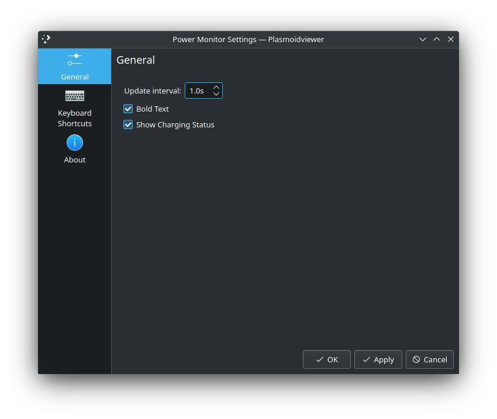

# Power Monitor
A stupidly simple KDE Plasma 5 widget to monitor the power consumption of your laptop battery in real time.

## Preview

## Installation
There are two ways to install this widget in your KDE Plasma.

1. Head over to the Plasma Add-On installer by going to: `Right click on Desktop -> Add Widgets -> Get New Widgets -> Search and Install this Widget`.
2. Download the `powerMonitor.plasmoid` file shared in this repo's [release section](https://github.com/atul-g/plasma-power-monitor/releases/tag/v0.1) or from the widget's KDE Store [link](https://www.pling.com/p/1466838/). After this, you can just do this: `Right Click on Desktop -> Add Widgets -> Install from local file -> Point to the downloaded package.plasmoid file`.

## Customization
As of now there are only two configuration settings; To make the text bold and to alter the update interval of the widgets:  

### Note
1. The widget displays power consumption in Watts.
2. This widget makes use of the `/sys/class/powe_supply/BAT[i]/` files to query the voltage and current consumption. If the widget displays "0.0 W", then chances are that you don''t have this file in your Linux Distribution.
3. The power usage rises continously when the laptop is plugged in to A/C power. It is normal if you see high readings.

### Development
For testing purpose, you can use `plasmoidviewer` command (you will need to install `plasma-sdk` with your OS package manager before that).  
- Make source code changes  
- Simply run `plasmoidviewer -a /path/to/package/folder/package` (eg, `plasmoidviewer -a ~/plasma-power-monitor/package`)

**Making the plasmoid file**  
- Simply compress the `package` folder into a ZIP archive.  
- rename the resultant zip file, change the extension to `plasmoid` from `zip`.  
- Use this to install the widget from local file.  
